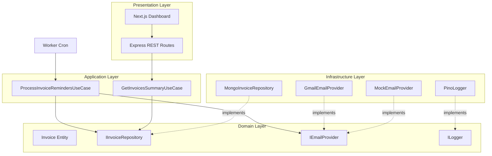
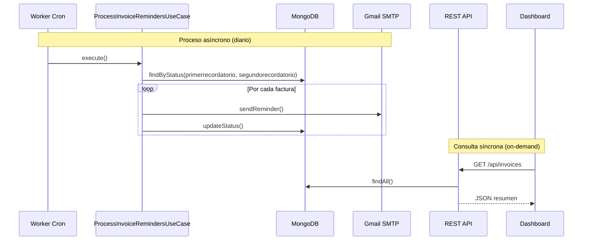
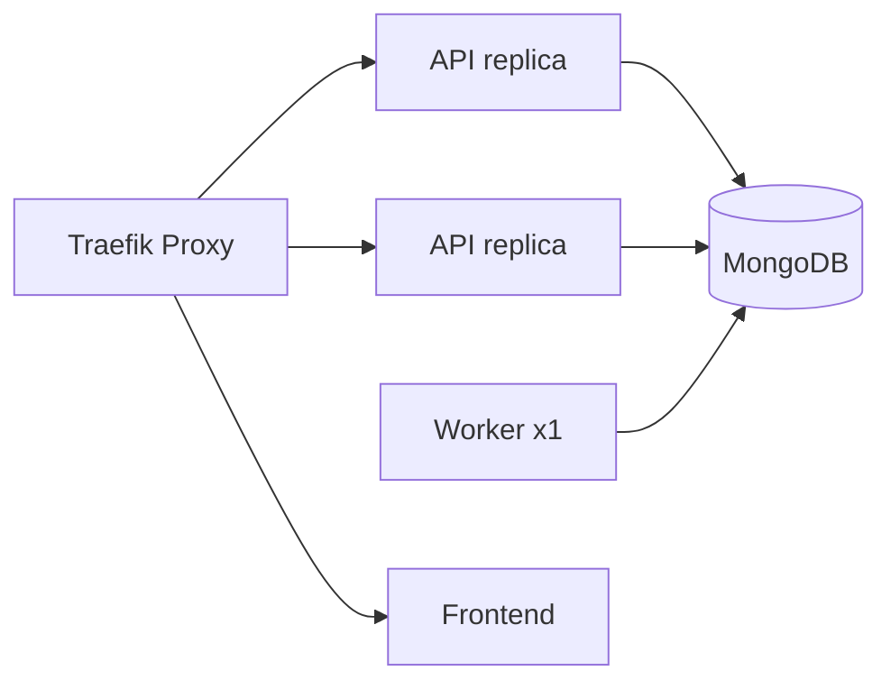
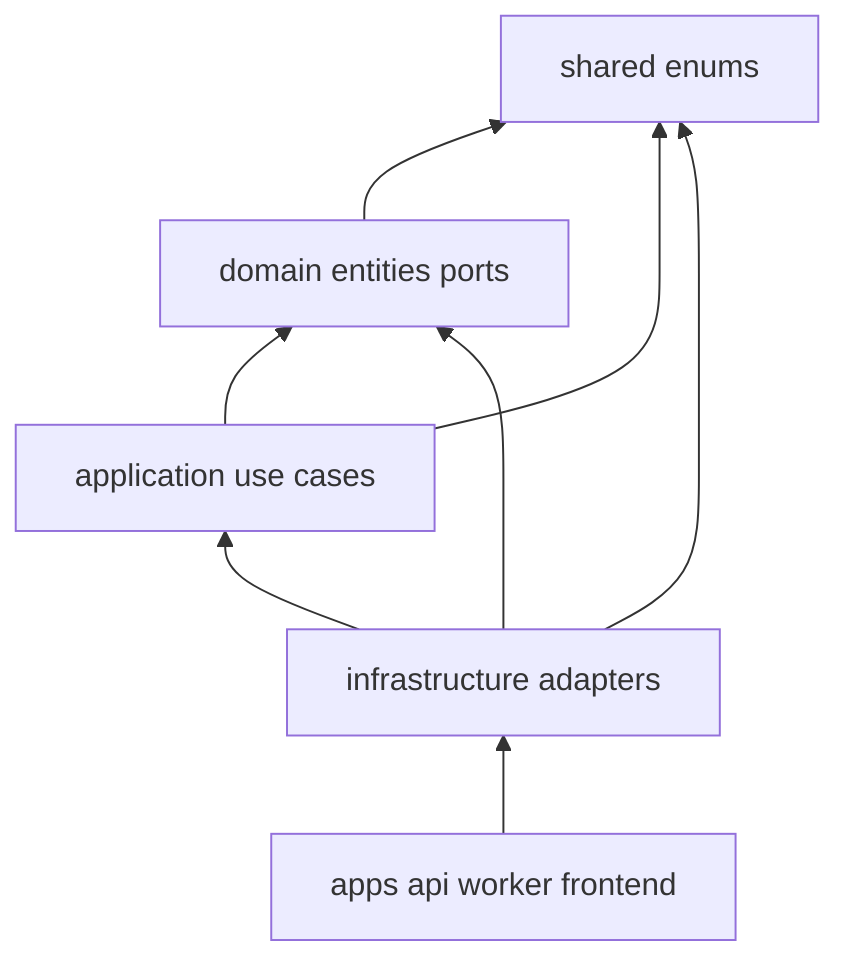

# Arquitectura — Monolegal Challenge

Documento de referencia arquitectónica para el sistema de automatización de notificaciones de facturación y dashboard de visualización.

---

## 1. Visión general

El sistema procesa recordatorios de facturación de forma **asíncrona** mediante un Worker en segundo plano, mientras expone una **API REST** para consultas y un **dashboard Next.js** para visualización operativa.



---

## 2. Clean Architecture — Capas y responsabilidades

### 2.1 Domain (Dominio)

**Ubicación:** `packages/domain`

Contiene las reglas de negocio puras, independientes de frameworks y bases de datos.

- **Entidades:** `Invoice` con estados `al_dia`, `primerrecordatorio`, `segundorecordatorio`, `desactivado`.
- **Ports (interfaces):** contratos que la infraestructura debe cumplir (`IInvoiceRepository`, `IEmailProvider`, `ILogger`).

**Regla de dependencia:** el dominio no importa nada de capas externas.

### 2.2 Application (Casos de uso)

**Ubicación:** `packages/application`

Orquesta la lógica de negocio aplicando el **Principio de Responsabilidad Única (SRP)**:

| Caso de uso | Responsabilidad |
|-------------|-----------------|
| `ProcessInvoiceRemindersUseCase` | Procesar recordatorios y transicionar estados |
| `GetInvoicesSummaryUseCase` | Obtener resumen de facturas para el dashboard |

Reciben dependencias **por inyección** (constructor), nunca instancian adaptadores concretos.

### 2.3 Infrastructure (Infraestructura)

**Ubicación:** `packages/infrastructure`

Implementaciones concretas de los ports:

- `MongoInvoiceRepository` — persistencia en MongoDB
- `GmailEmailProvider` — envío vía SMTP (Nodemailer + Gmail)
- `MockEmailProvider` — simulación para tests y desarrollo
- `PinoLogger` — logs estructurados JSON
- `Container` — composición root (DI manual)

### 2.4 Presentation (Presentación)

**Ubicación:** `apps/api`, `apps/worker`, `apps/frontend`

- **API:** expone endpoints HTTP, delega a casos de uso.
- **Worker:** entrypoint cron, ejecuta el caso de uso de recordatorios.
- **Frontend:** consume la API, renderiza dashboard.

---

## 3. Separación API / Worker — Sistema asíncrono

### 3.1 Problema que resuelve

El envío de correos es una operación **lenta e impredecible** (latencia de red, rate limits de Gmail, reintentos). Ejecutarla en el hilo de la API REST bloquearía las peticiones HTTP y degradaría la experiencia del dashboard.

### 3.2 Solución



### 3.3 Beneficios

| Aspecto | Beneficio |
|---------|-----------|
| **Resiliencia** | Fallo en envío de email no afecta la API |
| **Escalabilidad** | Worker y API escalan de forma independiente en Docker Swarm |
| **SRP** | Cada servicio tiene una única razón para cambiar |
| **Observabilidad** | Logs separados por servicio (`service: api` vs `service: worker`) |

---

## 4. Observabilidad — Logs estructurados

Utilizamos **Pino** para generar logs JSON en producción y formato legible en desarrollo (`pino-pretty`).

### 4.1 Campos estándar

```json
{
  "level": "info",
  "time": "2026-06-12T08:00:00.000Z",
  "service": "worker",
  "correlationId": "uuid-v4",
  "msg": "Invoice reminder processed",
  "invoiceId": "665a1b2c3d4e5f678901234",
  "previousStatus": "primerrecordatorio",
  "newStatus": "segundorecordatorio"
}
```

### 4.2 Estrategia

- **`correlationId`:** identifica una ejecución completa del worker o una petición HTTP. Generado en `apps/api` (middleware `request-context`) y en cada ejecución del worker (`runJob`).
- **`service`:** discrimina origen (`api`, `worker`, `seed`).
- **Niveles:** `debug` (dev), `info` (operaciones normales), `warn` (reintentos), `error` (fallos por factura sin abortar lote).
- **Agregación futura:** formato JSON compatible con ELK, Datadog o CloudWatch sin cambios de código.

---

## 5. Escalabilidad

### 5.1 Componentes stateless

- **API:** sin estado en memoria; N réplicas detrás de Traefik.
- **Worker:** idempotente por diseño (consulta DB, procesa, actualiza); múltiples réplicas requieren lock distribuido (fuera de alcance del reto; se despliega 1 réplica).

### 5.2 MongoDB como single source of truth

Toda la información de facturas vive en MongoDB. Los servicios no comparten memoria ni archivos.

### 5.3 Docker Swarm



---

## 6. Inyección de dependencias

DI **manual** mediante factory en `packages/infrastructure/src/di/container.ts`:

- Sin framework pesado (Inversify, TSyringe); suficiente para el alcance del reto.
- Cumple **Dependency Inversion Principle (DIP):** casos de uso dependen de abstracciones.
- Facilita testing: mocks inyectados en constructor.

```typescript
// Ejemplo conceptual
const container = await createContainer(config);
const apiDeps = toApiDependencies(container);
const app = createApp({ ...apiDeps, corsOrigin });
```

La API recibe solo `ApiDependencies` (caso de uso + logger), no el container completo — **Interface Segregation Principle (ISP)**.

---

## 6.1 Integridad email y estado

El worker procesa cada factura en este orden:

1. Enviar email de recordatorio
2. Actualizar estado en MongoDB

**Justificación:** no se avanza el estado si el envío de correo falla.

**Trade-off documentado:** si el email se envía correctamente pero `updateStatus` falla (p. ej. caída de DB), la factura permanece en el estado anterior y un reintento podría enviar un email duplicado. El caso de uso registra un `warn` con `emailAlreadySent: true` para facilitar la detección operativa. No se implementa outbox ni cola persistente — fuera del alcance del reto.

---

## 6.2 SOLID en el código

| Principio | Dónde se aplica |
|-----------|-----------------|
| **SRP** | Un caso de uso = una acción de negocio; `main.ts` solo arranca; `createApp` configura HTTP; `invoice.mapper` serializa respuestas |
| **OCP** | Nuevos proveedores de email vía `IEmailProvider`; seed vía `IInvoiceSeeder` sin tocar el repositorio de lectura/escritura |
| **LSP** | `MockEmailProvider` y `GmailEmailProvider` son intercambiables bajo `IEmailProvider` |
| **ISP** | API depende de `GetInvoicesSummaryUseCase`, no de `Container`; `findAll` devuelve `InvoiceSummary` (read model) y `findByStatus` devuelve `Invoice` (write model) |
| **DIP** | Application depende de ports en domain (`IInvoiceRepository`, `IEmailProvider`, `ILogger`); infrastructure implementa |

### Dependencias entre paquetes



`domain` no importa `application` ni `infrastructure`. Los ports (`IInvoiceRepository`, `IEmailProvider`, `ILogger`, `IInvoiceSeeder`) viven en `packages/domain`.

---

## 7. Modelo de dominio — Invoice

### Estados

| Estado | Valor | Descripción |
|--------|-------|-------------|
| Al día | `al_dia` | Factura vigente, sin acción |
| Primer recordatorio | `primerrecordatorio` | Pendiente de envío de 1er aviso |
| Segundo recordatorio | `segundorecordatorio` | Pendiente de envío de 2do aviso |
| Desactivado | `desactivado` | Servicio desactivado tras 2do aviso |

### Transiciones (Worker)

```
primerrecordatorio  →  segundorecordatorio  (email: aviso de 2do recordatorio)
segundorecordatorio →  desactivado           (email: aviso de desactivación)
```

---

## 8. Integración de correo — Gmail SMTP

- **Librería:** Nodemailer
- **Transport:** `smtp.gmail.com:587` (STARTTLS)
- **Autenticación:** contraseña de aplicación de Google (requiere 2FA)
- **Alternancia:** variable `EMAIL_PROVIDER=mock|gmail`
- **Tests:** siempre `MockEmailProvider` (sin red)

---

## 9. Estructura del monorepo

```
monolegal-challenge/
├── packages/
│   ├── shared/           # Enums y tipos compartidos (shared kernel)
│   ├── domain/           # Entidades, errores de dominio y ports
│   ├── application/      # Casos de uso + tests Jest
│   └── infrastructure/   # Adaptadores + DI container
├── apps/
│   ├── api/              # REST API (Express)
│   ├── worker/           # Cron job
│   └── frontend/         # Next.js dashboard
├── scripts/              # Seed de datos
├── docker/               # Dockerfiles multi-stage
├── docker-compose.yml    # Swarm + Traefik
├── ARCHITECTURE.md
└── DEPLOYMENT.md
```

---

## 10. Decisiones técnicas registradas

| Decisión | Alternativa descartada | Justificación |
|----------|------------------------|---------------|
| Monorepo (npm) | Multi-repo | Desarrollo coordinado, tipos compartidos |
| Express | Fastify/NestJS | Simplicidad; 2 endpoints no justifican framework |
| Mongoose | Driver nativo | Schema validation, índices declarativos |
| DI manual | Inversify | Menor complejidad, mismo beneficio SOLID |
| Gmail SMTP | SendGrid/Resend | Requerimiento del equipo (cuenta Gmail propia) |
| Pino | Winston | Mejor rendimiento, JSON nativo |
| node-cron | Bull/BullMQ | No se requiere cola persistente para cron diario |

---

## 11. Seguridad (consideraciones)

- Credenciales Gmail solo en variables de entorno, nunca en código.
- API de solo lectura (`GET`) en el alcance del reto.
- CORS restringido al dominio del frontend.
- Contenedores Docker con usuario no-root.

---

*Documento generado como parte del Hito 1 — Reto del Arquitecto Monolegal.*
