# Arquitectura — Monolegal Challenge

Documento de referencia arquitectónica para el sistema de gestión de facturación, clientes, recordatorios automáticos y dashboard operativo.

| Diagrama                 | Archivo                                                              | Sección  |
| ------------------------ | -------------------------------------------------------------------- | -------- |
| Contexto del sistema     | [01-contexto-sistema.png](docs/diagrams/01-contexto-sistema.png)     | §1.1     |
| Capas Clean Architecture | [02-clean-architecture.png](docs/diagrams/02-clean-architecture.png) | §1.2     |
| Máquina de estados       | [03-maquina-estados.png](docs/diagrams/03-maquina-estados.png)       | §3.2     |
| Stack backend            | [04-stack-backend.png](docs/diagrams/04-stack-backend.png)           | §1.3     |
| Stack frontend + BFF     | [05-stack-frontend.png](docs/diagrams/05-stack-frontend.png)         | §1.3, §4 |
| Flujo recordatorio       | [06-flujo-recordatorio.png](docs/diagrams/06-flujo-recordatorio.png) | §3.3     |
| Despliegue Swarm         | [07-despliegue.png](docs/diagrams/07-despliegue.png)                 | §9       |
| Ports & Adapters         | [08-ports-adapters.png](docs/diagrams/08-ports-adapters.png)         | §2.6     |
| Modelo de datos          | [09-modelo-datos.png](docs/diagrams/09-modelo-datos.png)             | §5       |
| Composition root (DI)    | [10-composition-root.png](docs/diagrams/10-composition-root.png)     | §7       |
| Pirámide de tests        | [11-piramide-tests.png](docs/diagrams/11-piramide-tests.png)         | §8       |
| Dependencias monorepo    | [12-monorepo-deps.png](docs/diagrams/12-monorepo-deps.png)           | §2.8     |
| API vs Worker            | [13-api-vs-worker.png](docs/diagrams/13-api-vs-worker.png)           | §3.1     |

---

## 0. Enunciado del reto y trazabilidad

### 0.1 Enunciado

El reto exige:

1. Conectarse a MongoDB y extraer facturas de clientes.
2. Revisar que el **estado** sea `primerrecordatorio` o `segundorecordatorio`.
3. Enviar un email al cliente según el estado encontrado (aviso de segundo recordatorio o de desactivación inminente).
4. Tras enviar el correo, actualizar el estado a `segundorecordatorio` o `desactivado`.
5. Funcionar con **3 clientes** distintos.
6. Mostrar un **resumen de todas las facturas** en una interfaz gráfica.

Criterios de evaluación: **Clean Code**, **SOLID**, **Unit Test**, **documentación/planteamiento/arquitectura** e **inyección de dependencias**.

### 0.2 Trazabilidad requisito → implementación

| Requisito                                            | Componente                                        | Archivo clave                                                    | Sección / diagrama                                     |
| ---------------------------------------------------- | ------------------------------------------------- | ---------------------------------------------------------------- | ------------------------------------------------------ |
| Conexión MongoDB                                     | `MongoInvoiceRepository`, `MongoClientRepository` | `packages/infrastructure/src/persistence/`                       | §5                                                     |
| Extraer facturas por estado                          | `findByStatus(REMINDER_STATUSES)`                 | `packages/application/src/process-invoice-reminders.use-case.ts` | §3.3, [flujo](docs/diagrams/06-flujo-recordatorio.png) |
| Validar `primerrecordatorio` / `segundorecordatorio` | Entidad `Invoice` + enum compartido               | `packages/domain/src/entities/invoice.ts`                        | §3.2, [estados](docs/diagrams/03-maquina-estados.png)  |
| Email según estado                                   | `buildReminderPayload()` + `IEmailProvider`       | `packages/domain/src/entities/invoice.ts`                        | §6                                                     |
| Actualizar estado tras email                         | `processInvoice()` → `updateStatus`               | `packages/application/src/process-invoice-reminders.use-case.ts` | §6.1, ADR-05                                           |
| 3 clientes                                           | Seed fijo                                         | `scripts/seed.ts`                                                | §5.3                                                   |
| Resumen de facturas en UI                            | `GetInvoicesSummaryUseCase` + dashboard           | `apps/frontend/src/app/page.tsx`                                 | §4, [frontend](docs/diagrams/05-stack-frontend.png)    |
| Clean Code / SOLID                                   | Capas separadas, un use case por acción           | `packages/domain/`, `packages/application/`                      | §2                                                     |
| Unit Test                                            | Jest con mocks de ports                           | `packages/**/__tests__/`                                         | §8                                                     |
| Inyección de dependencias                            | `createContainer()` + constructor injection       | `packages/infrastructure/src/di/container.ts`                    | §7                                                     |
| Documentación y arquitectura                         | Este documento                                    | `ARCHITECTURE.md`                                                | Todo el documento                                      |
| Stack backend / frontend                             | Node, Express, Next.js, React, etc.               | `apps/*/package.json`                                            | §1.3, ADR-13 a ADR-16                                  |

---

## 1. Visión general

El sistema procesa recordatorios de facturación de forma **asíncrona** mediante un Worker en segundo plano, mientras expone una **API REST** con CRUD de clientes y facturas, y un **dashboard Next.js** para gestión operativa.

### 1.1 Diagrama C4 — Contexto del sistema

Sitúa al sistema frente a actores y sistemas externos antes de entrar en capas internas.

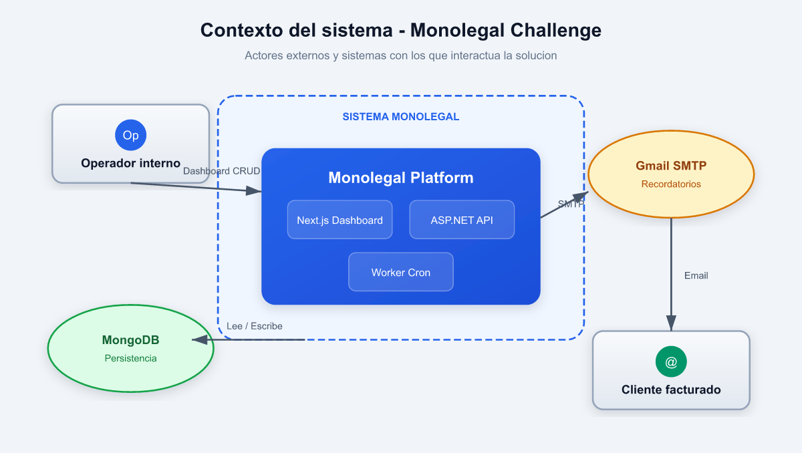

**Por qué este diagrama primero:** un evaluador puede entender el alcance del sistema (quién interactúa y con qué sistemas externos) sin conocer la estructura interna del monorepo.

### 1.2 Diagrama de capas — Clean Architecture

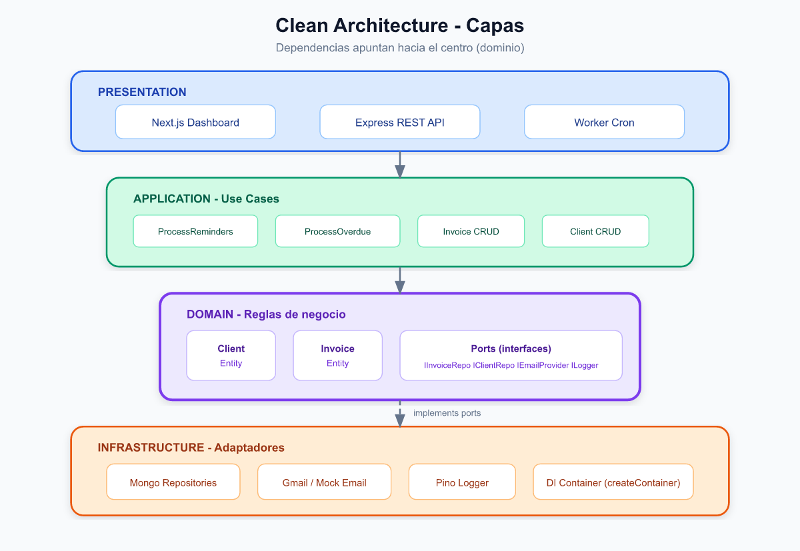

### 1.3 Stack tecnológico — Backend y Frontend

Decisiones explícitas sobre cada tecnología del stack, con alternativas descartadas y justificación.

#### Backend & Worker

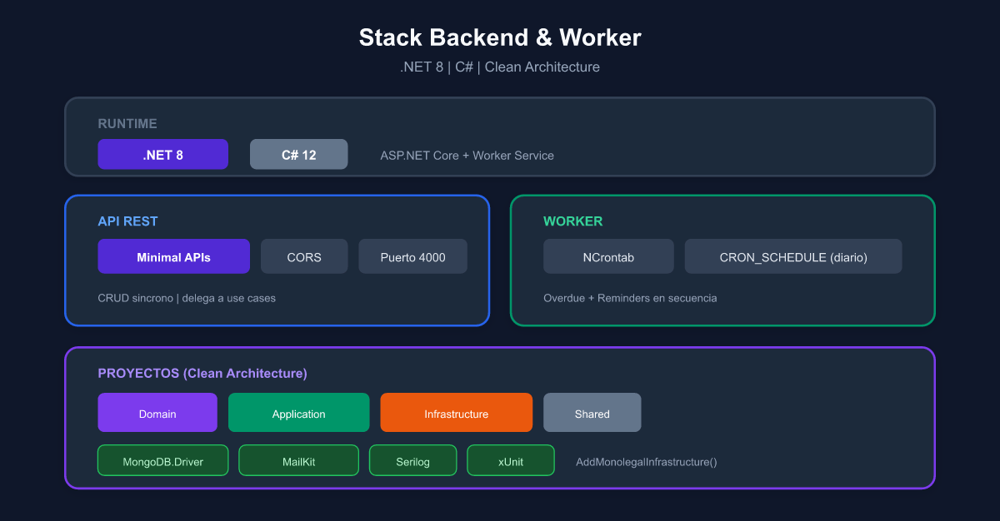

| Tecnología     | Versión | Rol         | Por qué esta elección                                                                      | Alternativa descartada                                                                                      |
| -------------- | ------- | ----------- | ------------------------------------------------------------------------------------------ | ----------------------------------------------------------------------------------------------------------- |
| **Node.js**    | ≥ 20    | Runtime (frontend)     | Migrado a .NET 8 para API y Worker |
| **.NET**       | 8.0     | Backend API + Worker   | ASP.NET Core + Worker Service + xUnit |
| **TypeScript** | 5.7     | Lenguaje (frontend)    | Tipado estático en capas frontend |
| **Express**    | —       | —                      | Reemplazado por ASP.NET Core Minimal APIs |
| **Mongoose**   | 8.9     | ODM MongoDB | Schemas, validación e índices declarativos; aggregation `$lookup` para summaries           | Driver nativo (más boilerplate); Prisma (soporte Mongo limitado)                                            |
| **Nodemailer** | 6.9     | Email SMTP  | Estándar de facto para Gmail SMTP en Node; integración simple con `IEmailProvider`         | SendGrid SDK (requerimiento del reto: Gmail propio)                                                         |
| **Pino**       | 9.6     | Logging     | JSON nativo, alto rendimiento, bajo overhead en worker cron                                | Winston (más lento); console.log (no estructurado)                                                          |
| **node-cron**  | 3.0     | Scheduler   | Cron diario expresivo (`CRON_SCHEDULE`); sin infra extra                                   | BullMQ (requiere Redis, overkill para 1 job/día)                                                            |
| **tsx**        | 4.19    | Dev runner  | Hot reload en API/worker sin compilar en cada cambio                                       | nodemon + tsc (más lento)                                                                                   |
| **Jest**       | —       | —                      | Reemplazado por xUnit + Moq en backend .NET |

#### Frontend

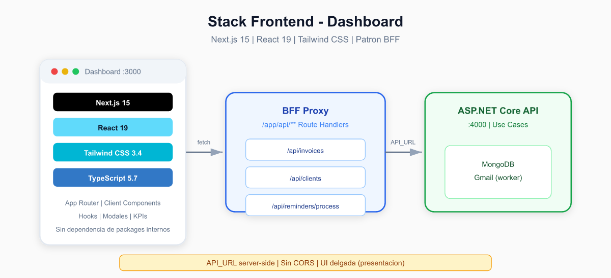

| Tecnología       | Versión | Rol                | Por qué esta elección                                                             | Alternativa descartada                                                            |
| ---------------- | ------- | ------------------ | --------------------------------------------------------------------------------- | --------------------------------------------------------------------------------- |
| **Next.js**      | 15.1    | Framework UI + BFF | App Router, Route Handlers como proxy server-side, SSR/SSG disponible             | Vite + React SPA (sin BFF integrado, CORS manual); Remix (menor ecosistema)       |
| **React**        | 19      | UI library         | Componentes declarativos, hooks para estado local del dashboard                   | Vue/Svelte (requisito implícito de stack React en retos frontend)                 |
| **Tailwind CSS** | 3.4     | Estilos            | Utility-first, prototipado rápido de tablas, KPIs y modales sin CSS custom masivo | CSS Modules (más verboso); component library (Material UI añade peso innecesario) |
| **TypeScript**   | 5.7     | Tipado frontend    | Tipos compartidos mental model con backend; hooks y props tipados                 | PropTypes (obsoleto en TS)                                                        |

**Por qué el frontend no depende de `@monolegal/*`:** mantiene el dashboard como capa de presentación pura. Consume JSON de la API vía proxy; no importa lógica de dominio ni casos de uso — desacoplamiento total entre UI y backend.

**Por qué Tailwind y no un design system completo:** el reto pide interfaz funcional (tablas, KPIs, filtros), no un producto de diseño. Tailwind permite iterar rápido sin sacrificar legibilidad.

---

## 2. Clean Architecture — Capas y responsabilidades

### 2.1 Por qué Clean Architecture en monorepo npm

| Aspecto                      | Detalle                                                                                                                                                 |
| ---------------------------- | ------------------------------------------------------------------------------------------------------------------------------------------------------- |
| **Problema**                 | El reto mezcla persistencia, email, reglas de negocio y UI. Acoplar todo en un solo módulo dificulta tests, evolución y evaluación de SOLID.            |
| **Decisión**                 | Monorepo con 4 packages (`shared`, `domain`, `application`, `infrastructure`) y 3 apps (`api`, `worker`, `frontend`) con dependencias unidireccionales. |
| **Alternativas descartadas** | NestJS monolítico (más framework que lógica de negocio); multi-repo (fricción al compartir enums y tipos).                                              |
| **Consecuencia**             | Cada capa testeable de forma aislada; worker y API comparten casos de uso sin duplicar lógica.                                                          |

### 2.2 Domain (Dominio)

**Ubicación:** `packages/domain`

Contiene las reglas de negocio puras, independientes de frameworks y bases de datos.

- **Entidades:** `Client` (id, name, email) e `Invoice` (clientId, invoiceNumber, concept, amount, dueDate, status).
- **Ports (interfaces):** `IClientRepository`, `IInvoiceRepository`, `IEmailProvider`, `ILogger`, `IInvoiceSeeder`.
- **Errores de dominio:** `InvoiceTransitionError`, `ClientNotFoundError`, etc.

**Regla de dependencia:** el dominio no importa nada de capas externas.

**Por qué Rich Domain Model en `Invoice`:** las reglas de transición de estado y los templates de email son reglas de negocio, no detalles de SMTP ni MongoDB. Centralizarlas en la entidad evita un _Anemic Domain Model_ donde la lógica quedaría dispersa en use cases o repositorios.

### 2.3 Application (Casos de uso)

**Ubicación:** `packages/application`

Orquesta la lógica de negocio aplicando el **Principio de Responsabilidad Única (SRP)** — un caso de uso por acción de negocio:

| Caso de uso                                                                                                          | Responsabilidad                                                           |
| -------------------------------------------------------------------------------------------------------------------- | ------------------------------------------------------------------------- |
| `ProcessOverdueInvoicesUseCase`                                                                                      | Transicionar facturas `al_dia` vencidas a `primerrecordatorio`            |
| `ProcessInvoiceRemindersUseCase`                                                                                     | Procesar recordatorios, resolver email del cliente y transicionar estados |
| `GetInvoicesSummaryUseCase`                                                                                          | Listar resumen de facturas con datos del cliente (join)                   |
| `GetInvoiceByIdUseCase` / `CreateInvoiceUseCase` / `UpdateInvoiceUseCase` / `DeleteInvoiceUseCase`                   | CRUD de facturas                                                          |
| `GetClientsUseCase` / `GetClientByIdUseCase` / `CreateClientUseCase` / `UpdateClientUseCase` / `DeleteClientUseCase` | CRUD de clientes                                                          |

Reciben dependencias **por inyección** (constructor), nunca instancian adaptadores concretos.

**Por qué dos casos de uso de procesamiento:** transición por vencimiento (`ProcessOverdueInvoicesUseCase`) y envío de recordatorios (`ProcessInvoiceRemindersUseCase`) son responsabilidades distintas (SRP). El worker las ejecuta en secuencia, pero cada una puede invocarse de forma independiente desde la API.

### 2.4 Infrastructure (Infraestructura)

**Ubicación:** `packages/infrastructure`

Implementaciones concretas de los ports:

- `MongoClientRepository` — persistencia de clientes en MongoDB
- `MongoInvoiceRepository` — persistencia de facturas con CRUD y aggregation `$lookup`
- `GmailEmailProvider` — envío vía SMTP (Nodemailer + Gmail)
- `MockEmailProvider` — simulación para tests y desarrollo
- `PinoLogger` — logs estructurados JSON
- `Container` — composición root (DI manual)

### 2.5 Presentation (Presentación)

**Ubicación:** `apps/api`, `apps/worker`, `apps/frontend`

| App                                    | Responsabilidad                                        | Qué NO hace                                                    |
| -------------------------------------- | ------------------------------------------------------ | -------------------------------------------------------------- |
| **API** (`apps/api/src/routes/`)       | Enrutar HTTP, mapear DTOs, delegar a casos de uso      | No contiene reglas de negocio ni accede a MongoDB directamente |
| **Worker** (`apps/worker/src/main.ts`) | Programar cron, ejecutar casos de uso de procesamiento | No expone endpoints HTTP                                       |
| **Frontend** (`apps/frontend/`)        | UI, hooks de datos, proxy BFF hacia la API             | No contiene lógica de transición de estados ni envío de email  |

### 2.6 Ports & Adapters (Hexagonal)

El dominio define **ports** (contratos); la infraestructura provee **adapters** (implementaciones). Los casos de uso solo conocen abstracciones.

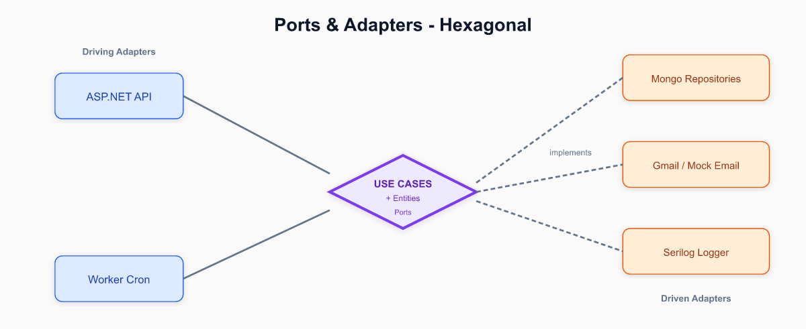

**Por qué Ports & Adapters:** permite sustituir MongoDB por otro repositorio, o Gmail por SendGrid, sin modificar casos de uso — cumple **OCP** y **DIP**.

### 2.7 SOLID en el código

| Principio | Dónde se aplica                                                                                                                |
| --------- | ------------------------------------------------------------------------------------------------------------------------------ |
| **SRP**   | Un caso de uso = una acción de negocio; routers solo enrutan HTTP; mappers solo serializan DTOs                                |
| **OCP**   | Nuevos proveedores de email vía `IEmailProvider`; nuevos repositorios implementando ports sin cambiar casos de uso             |
| **LSP**   | `MockEmailProvider` y `GmailEmailProvider` son intercambiables bajo `IEmailProvider`                                           |
| **ISP**   | API depende de `ApiDependencies` (solo use cases necesarios); `InvoiceSummary` es read model enriquecido con datos del cliente |
| **DIP**   | Application depende de ports en domain; casos de uso nunca importan Mongoose ni Nodemailer                                     |

### 2.8 Dependencias entre paquetes

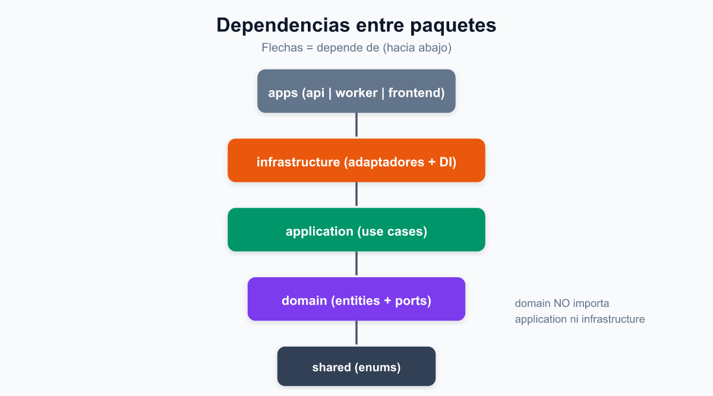

`domain` no importa `application` ni `infrastructure`. Los ports viven en `packages/domain`.

---

## 3. Flujo de recordatorios

Núcleo funcional del reto: detectar facturas elegibles, enviar email y actualizar estado.

### 3.1 Separación API / Worker — Sistema asíncrono

#### Problema que resuelve

El envío de correos es una operación **lenta e impredecible** (latencia de red, rate limits de Gmail, reintentos). Ejecutarla en el hilo de la API REST bloquearía las peticiones HTTP y degradaría la experiencia del dashboard.

#### Solución

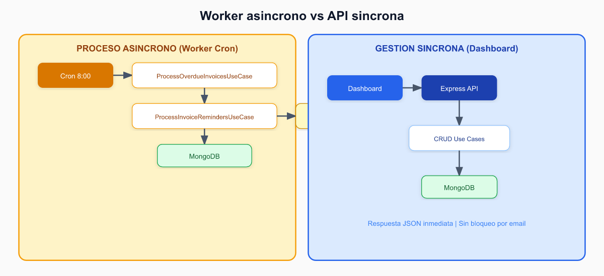

#### Beneficios

| Aspecto            | Beneficio                                                         |
| ------------------ | ----------------------------------------------------------------- |
| **Resiliencia**    | Fallo en envío de email no afecta la API                          |
| **Escalabilidad**  | Worker y API escalan de forma independiente en Docker Swarm       |
| **SRP**            | Cada servicio tiene una única razón para cambiar                  |
| **Observabilidad** | Logs separados por servicio (`service: api` vs `service: worker`) |

### 3.2 Máquina de estados de factura

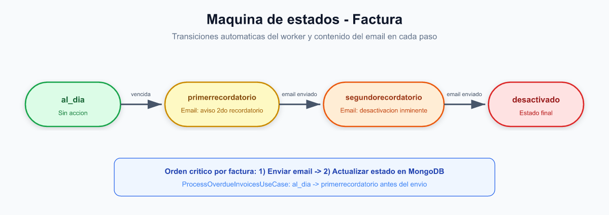

| Estado               | Valor                 | Descripción                         |
| -------------------- | --------------------- | ----------------------------------- |
| Al día               | `al_dia`              | Factura vigente, sin acción         |
| Primer recordatorio  | `primerrecordatorio`  | Pendiente de envío de 1er aviso     |
| Segundo recordatorio | `segundorecordatorio` | Pendiente de envío de 2do aviso     |
| Desactivado          | `desactivado`         | Servicio desactivado tras 2do aviso |

**Regla de vencimiento:** una factura en `al_dia` pasa a `primerrecordatorio` desde el día siguiente al vencimiento (`dueDate` estrictamente anterior a hoy). El día del vencimiento sigue en `al_dia`.

La lógica vive en la entidad `Invoice` (`isOverdueAt`, `shouldTransitionToFirstReminder`, `buildReminderPayload`) y se orquesta con los casos de uso.

### 3.3 Secuencia detallada — una factura

Flujo interno de `ProcessInvoiceRemindersUseCase.processInvoice()`:

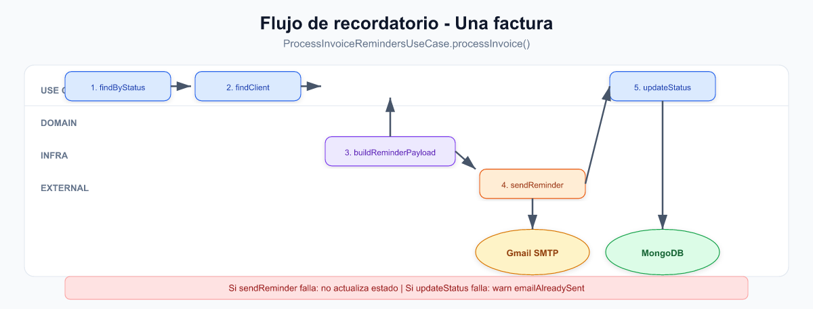

**Contenido del email según estado:**

- `primerrecordatorio` → avisa que pasará a segundo recordatorio si no paga → nuevo estado: `segundorecordatorio`
- `segundorecordatorio` → avisa desactivación inminente → nuevo estado: `desactivado`

### 3.4 Recordatorio manual desde la UI

El dashboard permite ejecutar recordatorios on-demand (botón global o por factura). El flujo sigue el patrón BFF descrito en §4:

1. **Dashboard** → `POST /api/reminders/process/:invoiceId` (Route Handler Next.js)
2. **Next.js proxy** → reenvía a Express con `API_URL`
3. **Express** → `ProcessInvoiceRemindersUseCase.executeForInvoiceId()`
4. Mismo flujo que §3.3: email → `updateStatus` → respuesta JSON → refetch de facturas en UI

**Por qué exponer recordatorios manuales además del cron:** facilita demostración y pruebas del reto sin esperar la ejecución programada del worker.

---

## 4. Frontend y dashboard

### 4.1 Arquitectura BFF / Proxy

El frontend Next.js no llama a Express directamente desde el navegador. Usa **Route Handlers** como proxy server-side (ver diagrama en §1.3):


**Por qué proxy Next.js en lugar de llamar Express directamente:**

| Razón             | Detalle                                                                                                 |
| ----------------- | ------------------------------------------------------------------------------------------------------- |
| **CORS**          | Evita configurar CORS complejo en desarrollo y producción                                               |
| **Encapsulación** | `API_URL` solo existe server-side; el navegador no conoce la URL interna de la API                      |
| **Evolución**     | Permite añadir auth, rate limiting o transformación de respuestas en el BFF sin tocar componentes React |

**Archivos clave del proxy:** `apps/frontend/src/app/api/invoices/route.ts`, `apps/frontend/src/app/api/clients/route.ts`, `apps/frontend/src/app/api/reminders/process/[invoiceId]/route.ts`.

### 4.2 Componentes y hooks

| Elemento              | Ubicación                            | Responsabilidad                                    |
| --------------------- | ------------------------------------ | -------------------------------------------------- |
| `DashboardPage`       | `apps/frontend/src/app/page.tsx`     | Orquestación de pestañas, filtros, KPIs y modales  |
| `InvoiceTable`        | `components/InvoiceTable.tsx`        | Tabla de facturas con acciones CRUD y recordatorio |
| `KpiCard`             | `components/KpiCard.tsx`             | Contadores por estado (resumen visual)             |
| `StatusFilterBar`     | `components/StatusFilter.tsx`        | Filtro por estado de factura                       |
| `InvoiceClientFilter` | `components/InvoiceClientFilter.tsx` | Filtro por cliente                                 |
| `useInvoices`         | `hooks/useInvoices.ts`               | Fetch y mutaciones de facturas                     |
| `useClients`          | `hooks/useClients.ts`                | Fetch y mutaciones de clientes                     |
| `useProcessReminders` | `hooks/useProcessReminders.ts`       | Ejecución manual de recordatorios                  |

### 4.3 Resumen de facturas

**Por qué el join en backend (`GetInvoicesSummaryUseCase`):** la aggregation `$lookup` en `MongoInvoiceRepository` enriquece cada factura con `clientName` y `clientEmail` en una sola consulta. Evita N+1 queries y mantiene la UI delgada — solo presentación, filtrado y ordenamiento local.

El dashboard muestra:

- KPIs por estado (`al_dia`, `primerrecordatorio`, `segundorecordatorio`, `desactivado`)
- Tabla completa con datos del cliente, concepto, monto, vencimiento y acciones
- Pestaña de clientes con gestión de email de destino de recordatorios

---

## 5. Persistencia MongoDB

### 5.1 Modelo de datos

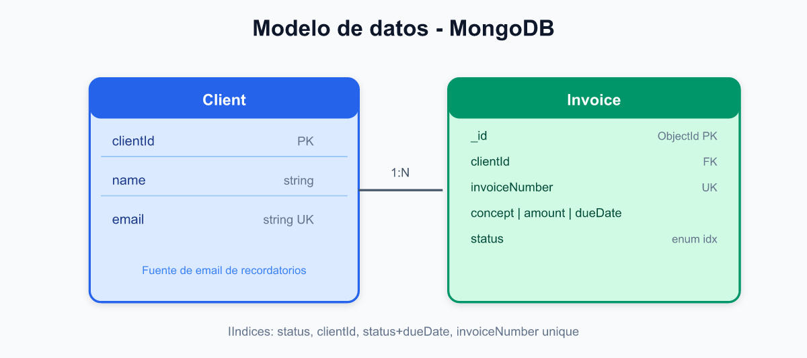

- **`Client`:** fuente única de verdad para nombre y **email de destino** de recordatorios.
- **`Invoice`:** referencia `clientId`; incluye `invoiceNumber` (formato `INV-YYYY-NNNN`) y `concept`.
- Al editar el email de un cliente, el worker usa el valor actual en la siguiente ejecución del cron.

### 5.2 Índices y consultas

| Índice    | Campos                 | Por qué                                      |
| --------- | ---------------------- | -------------------------------------------- |
| Simple    | `clientId`             | Filtrar facturas por cliente                 |
| Simple    | `status`               | `findByStatus` del worker                    |
| Compuesto | `{ status, clientId }` | Filtros combinados en dashboard              |
| Compuesto | `{ status, dueDate }`  | `findByStatusAndDueDateBefore` para vencidas |
| Unique    | `invoiceNumber`        | Evitar duplicados                            |

**Por qué Mongoose vs driver nativo:** schemas declarativos, validación en persistencia e índices en el schema — menor boilerplate para un reto con pocas entidades. El driver nativo ofrecería más control pero a costa de código repetitivo de validación.

### 5.3 Seed — 3 clientes

El script `scripts/seed.ts` inserta exactamente **3 clientes** fijos:

| ID                   | Nombre          | Email                    |
| -------------------- | --------------- | ------------------------ |
| `client-acme`        | Acme Corp       | billing@acme.com         |
| `client-legaltech`   | LegalTech SA    | finanzas@legaltech.co    |
| `client-consultores` | Consultores XYZ | pagos@consultoresxyz.com |

Más **15 facturas** aleatorias distribuidas entre los 3 clientes, con estado derivado del vencimiento.

**Por qué clientes fijos en seed:** cumple el requisito explícito del reto y permite demostrar recordatorios a destinatarios distintos sin configuración manual previa.

---

## 6. Email e integridad de estado

### 6.1 Integración Gmail SMTP

- **Librería:** Nodemailer
- **Transport:** `smtp.gmail.com:587` (STARTTLS)
- **Autenticación:** contraseña de aplicación de Google (requiere 2FA)
- **Alternancia:** variable `EMAIL_PROVIDER=mock|gmail`
- **Tests:** siempre `MockEmailProvider` (sin red)

**Por qué Gmail SMTP vs SendGrid/Resend:** requisito del equipo (cuenta Gmail propia). Implicaciones: rate limits de Gmail (~500 emails/día en cuenta gratuita), necesidad de app password y 2FA.

**Por qué `MockEmailProvider` + `GmailEmailProvider`:** cumple **LSP** (intercambiables bajo `IEmailProvider`); permite CI y desarrollo local sin credenciales ni red.

### 6.2 Orden crítico: email antes de actualizar estado

El worker procesa cada factura en este orden:

1. Enviar email de recordatorio
2. Actualizar estado en MongoDB

**Justificación:** no se avanza el estado si el envío de correo falla. El cliente no debe recibir un segundo recordatorio sin haber recibido el primero.

**Escenario de fallo documentado:** si el email se envía correctamente pero `updateStatus` falla (p. ej. caída de DB), la factura permanece en el estado anterior y un reintento podría enviar un email duplicado. El caso de uso registra un `warn` con `emailAlreadySent: true` para facilitar la detección operativa.

**Trade-off aceptado:** no se implementa outbox ni cola persistente — fuera del alcance del reto. En producción se resolvería con patrón Outbox o idempotency keys.

---

## 7. Inyección de dependencias

DI **manual** mediante factory en `packages/infrastructure/src/di/container.ts`:

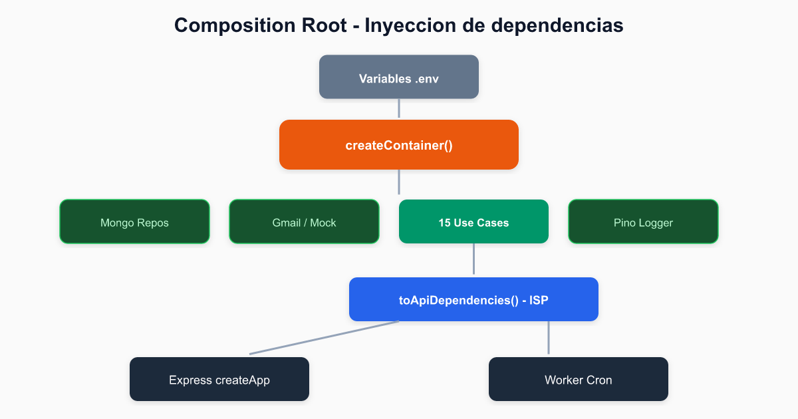

**Por qué DI manual vs Inversify/TSyringe:** el grafo de dependencias es pequeño (~15 use cases). Una factory explícita es más legible para evaluación del reto y cumple el mismo **DIP** — casos de uso dependen de abstracciones, nunca de implementaciones concretas.

**Interface Segregation (ISP):** la API recibe `ApiDependencies` con solo los use cases que necesita, no el container completo ni repositorios directamente:

```typescript
// packages/infrastructure/src/di/container.types.ts
export function toApiDependencies(container: Container): ApiDependencies {
  return {
    logger: container.logger,
    getInvoicesSummaryUseCase: container.getInvoicesSummaryUseCase,
    // ... solo use cases expuestos a la API
  };
}
```

El worker usa el container completo incluyendo `ProcessInvoiceRemindersUseCase` y `ProcessOverdueInvoicesUseCase`.

**Por qué constructor injection:** facilita testing — cada test instancia el use case con mocks de ports inyectados en el constructor, sin contenedor ni reflexión.

---

## 8. Estrategia de testing

### 8.1 Pirámide de tests

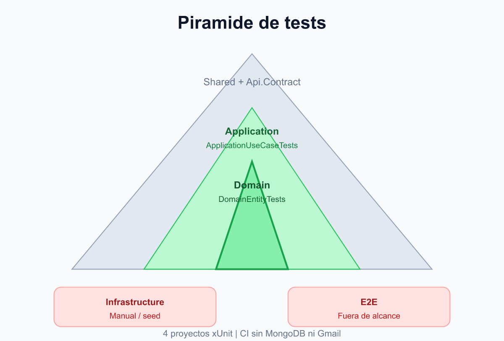

### 8.2 Cobertura por paquete

| Paquete                   | Archivos de test                    | Qué se valida                                                       |
| ------------------------- | ----------------------------------- | ------------------------------------------------------------------- |
| `packages/domain`         | `client.test.ts`, `invoice.test.ts` | Validación de entidades, transiciones de estado, templates de email |
| `packages/application`    | 14 archivos `.test.ts`              | Orquestación de use cases con mocks de ports                        |
| `packages/shared`         | `dummy-invoice-data.test.ts`        | Utilidades de fechas y generación de datos                          |
| `packages/infrastructure` | —                                   | Adaptadores validados manualmente vía seed + DEPLOYMENT             |
| `apps/*`                  | —                                   | Sin tests; delegan a use cases ya testeados                         |

**Total: 23 archivos de test.** Casos críticos del reto:

- `process-invoice-reminders.use-case.test.ts` — flujo email + updateStatus
- `process-overdue-invoices.use-case.test.ts` — transición por vencimiento
- `invoice.test.ts` — máquina de estados y contenido de emails

### 8.3 Por qué tests en domain/application y no en infrastructure

| Razón                   | Detalle                                                                                            |
| ----------------------- | -------------------------------------------------------------------------------------------------- |
| **Lógica crítica**      | Estados, emails y orquestación viven en domain y application                                       |
| **CI sin dependencias** | Ports mockeados permiten `npm test` sin MongoDB ni Gmail (`.github/workflows/ci.yml`)              |
| **ROI**                 | Un test de `Invoice.buildReminderPayload()` cubre reglas de negocio que afectan a worker, API y UI |

**Trade-off documentado:** adaptadores MongoDB/Gmail se validan manualmente. Tests E2E (Playwright/Cypress) quedan fuera del alcance del reto.

---

## 9. Despliegue y escalabilidad

### 9.1 Observabilidad — Logs estructurados

Utilizamos **Pino** para generar logs JSON en producción y formato legible en desarrollo (`pino-pretty`).

**Campos estándar:**

```json
{
  "level": "info",
  "time": "2026-06-12T08:00:00.000Z",
  "service": "worker",
  "correlationId": "uuid-v4",
  "msg": "Invoice reminder processed",
  "invoiceId": "665a1b2c3d4e5f678901234",
  "previousStatus": "primerrecordatorio",
  "newStatus": "segundorecordatorio"
}
```

**Estrategia:**

- **`correlationId`:** identifica una ejecución completa del worker o una petición HTTP.
- **`service`:** discrimina origen (`api`, `worker`, `seed`).
- **Niveles:** `debug` (dev), `info` (operaciones normales), `warn` (reintentos), `error` (fallos por factura sin abortar lote).

### 9.2 Componentes stateless y Docker Swarm

- **API:** sin estado en memoria; N réplicas detrás de Traefik.
- **Worker:** idempotente por diseño; múltiples réplicas requieren lock distribuido (fuera de alcance; se despliega 1 réplica).
- **MongoDB:** single source of truth para clientes y facturas.

**Por qué Docker Swarm + Traefik:** orquestación de contenedores con routing automático, TLS terminado en el proxy y escalado horizontal de la API — requisito del hito 5 de despliegue.

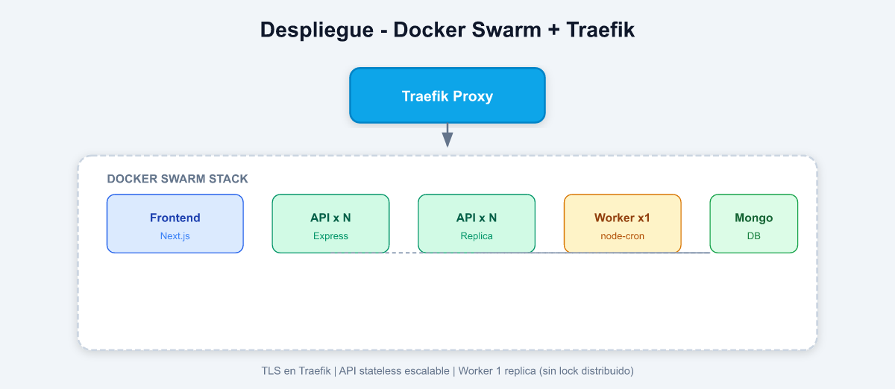

---

## 10. Decisiones arquitectónicas (ADR)

Registro formal de decisiones con contexto, alternativas y consecuencias.

### ADR-01: Clean Architecture en monorepo npm

- **Contexto:** el reto exige Clean Code, SOLID, DI y tests. Mezclar persistencia, email y UI dificulta cumplir estos criterios.
- **Decisión:** monorepo npm con 4 packages (`shared`, `domain`, `application`, `infrastructure`) y
  3 apps, con regla de dependencia unidireccional.
- **Alternativas consideradas:** NestJS monolítico (descartado: más framework que lógica); multi-repo (descartado: fricción con tipos compartidos).
- **Consecuencias:** cada capa testeable de forma aislada; curva de aprendizaje inicial mayor, pero evaluable por capas.

### ADR-02: Separación API / Worker

- **Contexto:** el envío de email es lento e impredecible; bloquearía peticiones HTTP del dashboard.
- **Decisión:** dos procesos independientes — API (CRUD síncrono) y Worker (cron asíncrono).
- **Alternativas consideradas:** procesar recordatorios en el mismo proceso Express (descartado: acopla latencia de email al CRUD); cola BullMQ (descartado: sobre-ingeniería para cron diario).
- **Consecuencias:** resiliencia y escalabilidad independiente; dos contenedores Docker en despliegue.

### ADR-03: Rich Domain Model en Invoice

- **Contexto:** reglas de transición de estado y templates de email son lógica de negocio del reto.
- **Decisión:** centralizar en la entidad `Invoice` (`buildReminderPayload`, `getNextStatusAfterReminder`, etc.).
- **Alternativas consideradas:** Anemic Domain Model con lógica en use cases (descartado: duplicación y difícil test unitario de reglas puras).
- **Consecuencias:** tests de dominio rápidos y expresivos; entidad más grande pero cohesiva.

### ADR-04: Dos casos de uso de procesamiento

- **Contexto:** el worker ejecuta dos pasos: transición por vencimiento y envío de recordatorios.
- **Decisión:** `ProcessOverdueInvoicesUseCase` y `ProcessInvoiceRemindersUseCase` separados.
- **Alternativas consideradas:** un solo use case monolítico (descartado: viola SRP); lógica en el worker directamente (descartado: worker sería orquestador de infraestructura).
- **Consecuencias:** cada paso invocable de forma independiente (API manual + cron); secuencia clara en `apps/worker/src/main.ts`.

### ADR-05: Email antes de updateStatus

- **Contexto:** el reto exige enviar email y luego actualizar estado. Hay que decidir el orden ante fallos parciales.
- **Decisión:** enviar email primero; solo actualizar estado si el envío fue exitoso.
- **Alternativas consideradas:** actualizar primero (descartado: cliente recibiría aviso de 2do recordatorio sin haber recibido el 1ro); outbox pattern (descartado: fuera de alcance).
- **Consecuencias:** integridad de negocio garantizada; riesgo de email duplicado si DB falla post-envío (mitigado con log `emailAlreadySent: true`).

### ADR-06: DI manual sin framework

- **Contexto:** el reto exige inyección de dependencias. El grafo es pequeño (~15 use cases).
- **Decisión:** factory `createContainer()` + constructor injection en use cases.
- **Alternativas consideradas:** Inversify/TSyringe (descartado: complejidad innecesaria para el alcance); service locator (descartado: oculta dependencias).
- **Consecuencias:** código explícito y legible para evaluadores; mismo cumplimiento de DIP que un framework.

### ADR-07: Mongoose como ODM

- **Contexto:** persistencia en MongoDB con 2 entidades y consultas de aggregation.
- **Decisión:** Mongoose con schemas, validación e índices declarativos.
- **Alternativas consideradas:** driver nativo de MongoDB (descartado: más boilerplate de validación); Prisma (descartado: soporte MongoDB limitado en el momento del reto).
- **Consecuencias:** schemas auto-documentados; acoplamiento a Mongoose solo en infrastructure (domain no lo conoce).

### ADR-08: Mock + Gmail como proveedores de email

- **Contexto:** tests deben correr en CI sin red; producción usa Gmail SMTP.
- **Decisión:** `IEmailProvider` con `MockEmailProvider` y `GmailEmailProvider`, seleccionados por `EMAIL_PROVIDER`.
- **Alternativas consideradas:** solo Gmail (descartado: CI dependiente de credenciales); Mailhog en Docker (descartado: infraestructura extra).
- **Consecuencias:** LSP cumplido; alternancia transparente para use cases.

### ADR-09: Next.js BFF proxy

- **Contexto:** el dashboard necesita consumir la API REST sin problemas de CORS ni exponer URLs internas.
- **Decisión:** Route Handlers en `apps/frontend/src/app/api/` que reenvían a Express server-side.
- **Alternativas consideradas:** llamar Express directamente desde el browser (descartado: CORS y exposición de URL); GraphQL (descartado: sobre-ingeniería).
- **Consecuencias:** frontend desacoplado de la URL de la API; posibilidad de añadir auth en el BFF.

### ADR-10: Pino para logs estructurados

- **Contexto:** operaciones distribuidas (API + worker) requieren trazabilidad sin acoplar a un vendor de observabilidad.
- **Decisión:** Pino con logs JSON, `correlationId` y campo `service`.
- **Alternativas consideradas:** Winston (descartado: menor rendimiento, JSON menos nativo); console.log (descartado: no estructurado).
- **Consecuencias:** logs agregables en ELK/Datadog/CloudWatch sin cambios de código; bajo overhead en producción.

### ADR-11: node-cron vs BullMQ

- **Contexto:** el worker ejecuta un job diario de recordatorios, no una cola de tareas compleja.
- **Decisión:** `node-cron` con schedule configurable (`CRON_SCHEDULE`).
- **Alternativas consideradas:** Bull/BullMQ (descartado: requiere Redis, sobre-ingeniería para cron diario); setInterval (descartado: menos expresivo para schedules).
- **Consecuencias:** simplicidad operativa; sin garantías de exactly-once en multi-réplica (aceptado: 1 réplica de worker).

### ADR-12: Sin autenticación en API

- **Contexto:** el sistema es una demo interna del reto, no expuesto a internet público.
- **Decisión:** API REST sin auth; CORS restringido al dominio del frontend.
- **Alternativas consideradas:** JWT (descartado: complejidad innecesaria para demo); API keys (descartado: gestión de secretos extra).
- **Consecuencias:** despliegue simple; no apto para producción pública sin añadir capa de auth (ver §13).

### ADR-13: Express como framework HTTP

- **Contexto:** la API expone ~13 endpoints CRUD REST sin lógica de framework compleja.
- **Decisión:** Express 4 con routers delgados.
- **Alternativas consideradas:** NestJS (descartado: decoradores, módulos y DI propia duplican el container manual); Fastify (descartado: beneficio marginal para CRUD simple).
- **Consecuencias:** curva de aprendizaje mínima; evaluador ve directamente use cases sin abstracciones del framework.

### ADR-14: Next.js 15 App Router

- **Contexto:** se requiere dashboard con resumen de facturas y proxy hacia API backend.
- **Decisión:** Next.js 15 con App Router y Route Handlers en `/app/api`.
- **Alternativas consideradas:** CRA/Vite SPA (descartado: CORS y sin BFF); Pages Router (descartado: App Router es el estándar actual de Next).
- **Consecuencias:** BFF integrado; SSR disponible si se necesita en el futuro.

### ADR-15: React 19 + hooks locales

- **Contexto:** UI con tablas, filtros, modales y KPIs reactivos.
- **Decisión:** React 19 con hooks custom (`useInvoices`, `useClients`) sin Redux/Zustand.
- **Alternativas consideradas:** Redux (descartado: estado local suficiente); Server Components para todo (descartado: interactividad CRUD requiere client components).
- **Consecuencias:** simplicidad; estado de UI co-localizado con componentes.

### ADR-16: Tailwind CSS para estilos

- **Contexto:** interfaz operativa funcional, no producto de diseño custom.
- **Decisión:** Tailwind CSS 3.4 utility-first.
- **Alternativas consideradas:** Material UI (descartado: bundle grande); CSS puro (descartado: más lento de iterar tablas y modales).
- **Consecuencias:** UI consistente con poco CSS custom; fácil de mantener.

---

## 11. API REST

| Método | Ruta                                | Descripción                                 |
| ------ | ----------------------------------- | ------------------------------------------- |
| GET    | `/api/clients`                      | Listar clientes                             |
| GET    | `/api/clients/:id`                  | Detalle de cliente                          |
| POST   | `/api/clients`                      | Crear cliente                               |
| PATCH  | `/api/clients/:id`                  | Actualizar nombre/email                     |
| DELETE | `/api/clients/:id`                  | Eliminar (bloqueado si tiene facturas)      |
| GET    | `/api/invoices`                     | Listar facturas con datos del cliente       |
| GET    | `/api/invoices/:id`                 | Detalle de factura                          |
| POST   | `/api/invoices`                     | Crear factura (genera `invoiceNumber`)      |
| PATCH  | `/api/invoices/:id`                 | Actualizar concept, amount, dueDate, status |
| DELETE | `/api/invoices/:id`                 | Eliminar factura                            |
| POST   | `/api/overdue/process`              | Transicionar facturas vencidas manualmente  |
| POST   | `/api/reminders/process`            | Ejecutar recordatorios manualmente (todas)  |
| POST   | `/api/reminders/process/:invoiceId` | Ejecutar recordatorio de una factura        |

Errores de dominio mapeados a HTTP: validación → 400, not found → 404.

---

## 12. Estructura del monorepo

```
monolegal-challenge/
├── backend/dotnet/       → Solución .NET (Shared, Domain, Application, Infrastructure, Api, Worker, Seed)
├── apps/frontend/        → Next.js dashboard
├── docs/
│   └── diagrams/         → Diagramas SVG (fuente) + PNG (preview Markdown)
├── scripts/              → Utilidades (diagramas)
├── docker/               → Dockerfiles multi-stage
├── docker-compose.yml    → Swarm + Traefik
├── ARCHITECTURE.md
└── DEPLOYMENT.md
```

---
